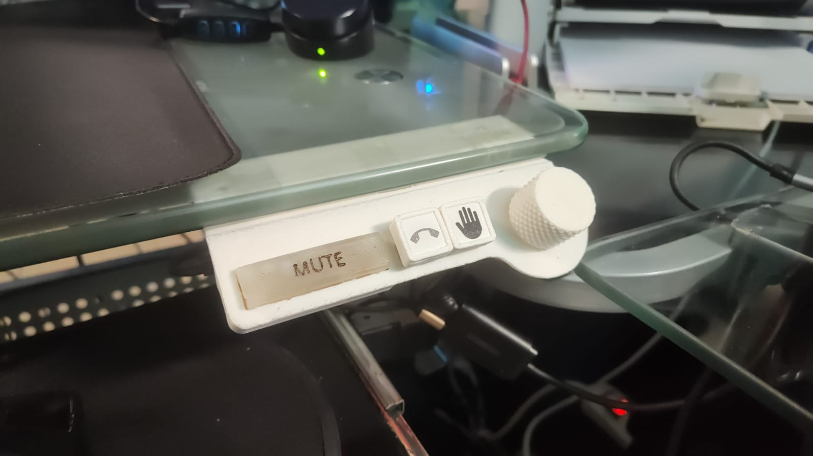
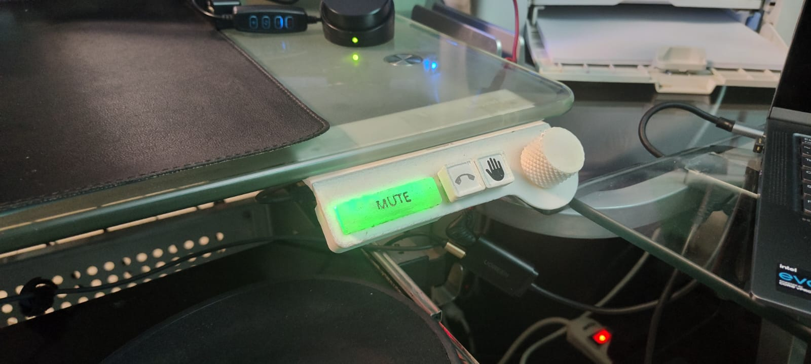
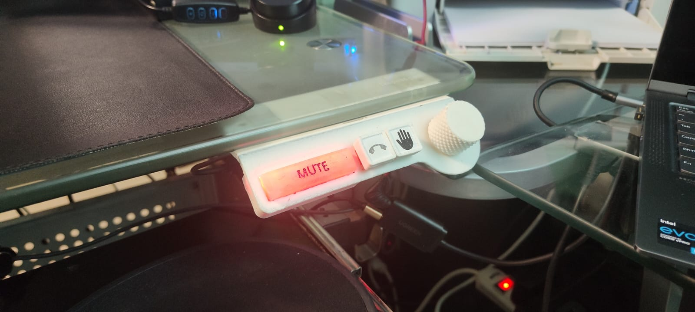

# Yapper for Google Meet - ESP32 BLE HID Telephony Controller

A dual-mode HID telephony device using an ESP32-S3 microcontroller that combines USB HID keyboard functionality with multi-client Bluetooth Low Energy for status updates. Designed for seamless integration with video conferencing applications like Google Meet.

Learn more about the design of this project in this blog post: [No More ‘Sorry, I Was on Mute’: How I built a DIY hardware solution for Google Meet with ESP32-S3](https://dev.to/rolandostar/no-more-sorry-i-was-on-mute-how-i-built-a-diy-hardware-solution-for-google-meet-with-esp32-s3-1ohh)

### USB Telephony HID Implementation

For developers interested in building their own telephony HID implementations, this project includes a [`usb_telephony_quick_start.ino`](usb_telephony_quick_start.ino) file that demonstrates how to use telephony descriptors with HID. This simplified example provides a foundation for creating custom telephony control devices using standard USB HID telephony usage pages.



## Features

- **Dual-Mode HID Connectivity**: USB HID for sending commands and BLE HID for receiving status updates
- **Multi-Client Bluetooth**: Connect to multiple host devices simultaneously via BLE
- **Universal Compatibility**: Works with Windows, macOS, Linux, and mobile devices
- **Multiple Input Methods**: Touch sensor, mechanical buttons, and rotary encoder
- **Visual Status Feedback**: RGB LED strip indicates mute status with customizable brightness
- **Smart State Management**: Internal mute state tracking when no Bluetooth devices connected
- **Auto-Reconnection**: Automatically reconnects to previously paired devices

## Control Mappings

### Button Functions
- **Left Button (GPIO 13)**: 
  - Single click: Send `Ctrl+Shift+F1` keyboard command (Used by Chroome extension to focus on the call tab)
  - Long press: Send hang up/drop call command
- **Right Button (GPIO 14)**: Send `Ctrl+Alt+H` keyboard command

### Rotary Encoder Functions
- **Rotation Left**: Previous slide (Left Arrow key) / Volume Down
- **Rotation Right**: Next slide (Right Arrow key) / Volume Up
- **Single Click**: Toggle between volume control and slides control
- **Double-Click**: Toggle push-to-talk mode
- **Long Press**: Activate Bluetooth pairing mode

### LED Status Indicators
| MUTED | UNMUTED |
|-----------|---------|
|  |  |

## Dependencies

- [PlatformIO](https://platformio.org/) development platform
- Arduino framework for ESP32

## Installation and Setup

### Prerequisites
1. Install [Visual Studio Code](https://code.visualstudio.com/)
2. Install the [PlatformIO extension](https://platformio.org/install/ide?install=vscode)

### Building and Flashing
1. Clone this repository:
   ```bash
   git clone <repository-url>
   cd google-meet-yapper
   ```
2. Open the project in VS Code with PlatformIO
3. Connect your ESP32-S3 device via USB
4. Build and upload:
   - Press `Ctrl+Shift+P` and run "PlatformIO: Upload"
   - Or use the PlatformIO toolbar buttons

## Usage Instructions

### Bluetooth Pairing
1. **Enter Pairing Mode**: Long press the rotary encoder to enable BLE advertising
2. **On Host Device**: 
   - Go to Bluetooth settings
   - Search for new devices
   - Look for "ESP32 Mute Control" in the device list
   - Select and pair
3. **Multi-Device Support**: Repeat the pairing process for additional host devices

### Operation
- **Mute Control**: Use touch sensor in toggle or push-to-talk mode
- **Call Control**: Use mechanical buttons for various telephony functions
- **Brightness Adjustment**: Send serial commands to adjust LED brightness
- **Volume/Slide Control**: Use rotary encoder to adjust volume or navigate slides
- **Mode Switching**: Single click on rotary encoder to switch between volume and slide control
- **Push-to-Talk**: Double-click rotary encoder to enable/disable push-to-talk mode
- **Calibration**: Send serial command to calibrate touch sensor sensitivity
- **Status Feedback**: LED strip provides visual confirmation of mute status

## Pin Configuration & Wiring

| Component | Function | Pin/Terminal | ESP32-S3 GPIO | Notes |
|-----------|----------|--------------|---------------|-------|
| **Left Button** | Mute Toggle | Terminal 1 | GPIO 13 | Internal pull-up enabled |
|  |  | Terminal 2 | GND |  |
| **Right Button** | Call Drop/Hang Up | Terminal 1 | GPIO 14 | Internal pull-up enabled |
|  |  | Terminal 2 | GND |  |
| **Rotary Encoder** | Channel A (CLK) | CLK | GPIO 5 | Internal pull-up enabled |
|  | Channel B (DT) | DT | GPIO 6 | Internal pull-up enabled |
|  | Push Switch | SW | GPIO 7 | Internal pull-up enabled |
| **LED Strip (APA102)** | Data Line | DI | GPIO 11 | SPI Data |
|  | Clock Line | CI | GPIO 12 | SPI Clock |
| **Touch Sensor** | Touch Input | Signal | GPIO 4 | Touch-capable pin |


## Development

### Project Structure
```
ESP32BLEHID/
├── src/                   # Source code
│   ├── main.cpp           # Main application logic
│   ├── communication/     # Bluetooth and HID handlers
│   ├── core/              # Device controller logic
│   └── hardware/          # Hardware abstraction layer
└── include/               # Header files
    ├── config.h           # Configuration constants
    ├── hidmap.h           # HID key mappings
    └── logger.h           # Logging utilities
```

### Hardware Resources

- **Button Label Icons**: For custom button labels and hardware modifications, refer to the [Google Docs file with button icons](https://docs.google.com/document/d/1Vj57xCYnKY_7HDGlUAXmhCYvv3rVUzAjlF8To578hUI/edit?usp=sharing) that includes printable icons and labels for the various control functions.
- **3D Models**: For 3D printable models of the enclosure and keycaps, check out the thingiverse and OnShape links in the [Attributions](#attributions) section below.

### Key Configuration Files
- `platformio.ini` - PlatformIO project configuration
- `include/config.h` - Hardware pin definitions and constants
- `include/hidmap.h` - HID key mapping definitions

## Contributing

We welcome contributions to improve the project! Please follow these guidelines:

1. **Fork the Repository**: Create your own fork of the project
2. **Create a Feature Branch**: 
   ```bash
   git checkout -b feature/your-feature-name
   ```
3. **Make Changes**: Implement your improvements
4. **Test Thoroughly**: Ensure your changes work across different scenarios
5. **Follow Code Style**: Maintain consistency with existing code
6. **Submit Pull Request**: Include a clear description of changes

### Reporting Issues
- Use the GitHub Issues tracker
- Include hardware configuration details
- Provide steps to reproduce any bugs
- Include relevant log output when possible

## License

This project is released under the BSD 3-Clause License. See the [LICENSE](LICENSE) file for details.

For information about third-party dependencies and their licenses, see [THIRD_PARTY_LICENSES.md](THIRD_PARTY_LICENSES.md).

## Attributions

This project builds upon inspiration and code from various open-source projects:

- **ESP32 BLE HID Implementation**: Based on examples from [esp-hid-device](https://github.com/espressif/esp-idf/tree/master/examples/bluetooth/esp_hid_device)
- **Hardware Mute Button Concepts**: Inspired by [Gergely Imreh's USB mute button](https://gergely.imreh.net/blog/2023/08/making-a-usb-mute-button-for-online-meetings/)
- **3D Models**: 
  - [Macropad by jagoan](https://www.thingiverse.com/thing:4865027)
  - [Knurled Knob by jagoan](https://www.thingiverse.com/thing:4535315)
  - [Relegendable Keycap by Mc_gee](https://www.thingiverse.com/thing:3791028)
  - [Relegendable Keycap Slim Stem](https://www.thingiverse.com/thing:4126150)
  - My own modifications available in OnShape: [Yapper for Google Meet Enclosure](https://cad.onshape.com/documents/1c1e93bdb9f94aa761edb510/w/a0c03c35815c13989b3527c8/e/c9705b58baebb140f33b728b)
    - Mold for silicon button included

<div align="center">
<h2>Contact & Support</h2>
<p>You can find me on <a href="http://steamcommunity.com/id/rolandostar/">Steam</a>, <a href="https://discord.com/users/rolandostar">Discord</a>, <a href="https://www.linkedin.com/in/rolandostar/">LinkedIn</a> and <a href="https://www.reddit.com/user/rolandostar">Reddit</a>!</p>
<p>If you like this project, please consider a small donation.</p>
<a href="https://www.paypal.com/cgi-bin/webscr?cmd=_s-xclick&hosted_button_id=7PK5YQ9HR3Z52"></a>
</div>

---

*Made with ❤️*